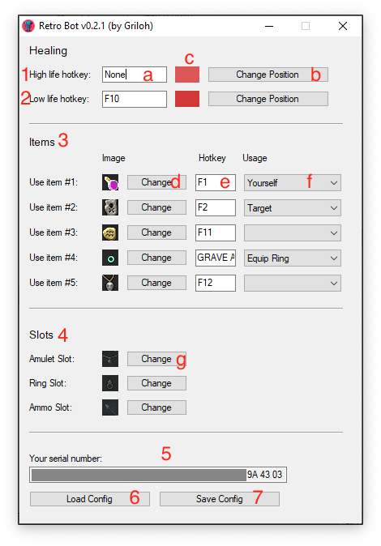

# RetroBot

## Instruções de uso RetroBot

### 1 e 2 – Healing em dois níveis

a)	Hotkey com a magia a ser disparada quando a cor da life bar mudar na posição selecionada no item b.
b)	Posição da life bar que funcionará como gatilho para a hotkey escolhida, quando mudar a cor a hotkey é disparada.
c)	Cor capturada na lifebar

### 3 – Items

d)	Imagem do item a ser utilizado
e)	Hotkey para usar o item
f)	Forma de uso do item

### 4 – Slots

g)	Trocar imagem do slot (para compatibilidade em clientes editados)

### 5 – Serial Number

Número único de identificação do seu computador.
O RetroBot funcionará gratuitamente durante 15 dias, após o período de testes deve-se entrar em contato com retrobot.help@gmail.com para renovação da licença.

### 6 – Carregar configuração salva

### 7 – Salvar configurações
